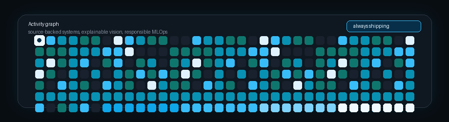

<h1 align="center">Aryan Nair</h1>

  <strong>AI/ML Engineer & Product Builder</strong> 
  B.Tech in AI & ML at MIT Manipal, graduating Oct 2026

  
  
  
  

<table>
  <tr>
    <td width="58%" valign="middle">
      <h3>Building AI systems that explain themselves</h3>
      

        I turn ML ideas into inspectable products: source-backed RAG, explainable vision,
        production APIs, and clean user interfaces around technical systems.
      

      

        My work sits where applied machine learning, product engineering, and trustworthy
        evidence meet.
      

    </td>
    <td width="42%" align="center" valign="middle">
      
    </td>
  </tr>
</table>

---

### What I Am Building Toward

| Focus | What I care about |
| --- | --- |
| **Source-grounded intelligence** | RAG systems with FAISS retrieval, MMR reranking, confidence scoring, and citation-first answers. |
| **Explainable vision** | Deepfake and medical-imaging workflows that pair model decisions with Grad-CAM style visual evidence. |
| **Responsible MLOps** | Carbon-aware experiment tracking, quantization gates, and practical ways to make model runs more efficient. |
| **Human-facing AI products** | FastAPI, React, Streamlit, and usable UX layers around ML systems so the work leaves the notebook. |

---

### Selected Work

| Project | What it does | Why it matters |
| --- | --- | --- |
| **[DocIntel-RAG](https://github.com/aryan12375/DocIntel-RAG)** | Production-style RAG system with FAISS search, MMR reranking, source highlighting, and confidence scoring. | Shows I can build retrieval systems that are grounded, inspectable, and useful beyond a chat demo. |
| **[face-forge-deepfake-detector](https://github.com/aryan12375/face-forge-deepfake-detector)** | Deepfake detection lab using EfficientNet-B4, Grad-CAM, FastAPI, React, and PyTorch. | Turns a model into an explainable application that users can actually inspect. |
| **[Mental-Health-Agent](https://github.com/aryan12375/Mental-Health-Agent)** | Safety-first conversational agent with risk scoring, passive digital phenotyping, and intervention protocols. | Combines AI product thinking with guardrails for a sensitive real-world domain. |
| **[Multimodal Sentiment Analysis](https://github.com/aryan12375/Multimodal-sentiment-analysis-)** | BERT + Wav2Vec2 sentiment pipeline with cross-attention fusion, sarcasm detection, and explainability. | Demonstrates multimodal ML, interpretation, and end-to-end experimentation. |
| **[Green MLOps](https://github.com/aryan12375/Carbon-aware-experiment-tracking-)** | Carbon-aware experiment tracking with runtime footprint estimates and adaptive quantization gates. | Pushes ML engineering toward systems that are accurate, efficient, and accountable. |
| **[Movie Rating Pipeline](https://github.com/aryan12375/movie-rating-analysis-pyspark)** | PySpark pipeline built for large-scale movie-rating analysis across millions of records. | Highlights data engineering fundamentals at a scale where clean pipelines matter. |

---

### Core Stack

  

| ML | Backend & APIs | Data | Frontend |
| --- | --- | --- | --- |
| PyTorch, TensorFlow, scikit-learn, Hugging Face, OpenCV, Grad-CAM | FastAPI, Python, SQL, Docker, Kafka | PySpark, FAISS, MySQL, retrieval pipelines, experiment tracking | React, JavaScript, HTML, CSS, Streamlit |

---

### Activity Graph

  

---

### The Throughline

I like building systems that make model output easier to trust. If a pipeline makes a prediction, I want to show the evidence. If an LLM gives an answer, I want to show the source. If an experiment improves performance, I want to know what it cost.

Useful, explainable, and built with enough care that someone else can pick it up and believe in it.

---

### Connect

- **Calendly:** [Schedule a conversation](https://calendly.com/aryannair3002)
- **LinkedIn:** [Connect with me](https://www.linkedin.com/in/aryan-nair-b65b3b281/)
- **Email:** [aryannair3002@gmail.com](mailto:aryannair3002@gmail.com)
